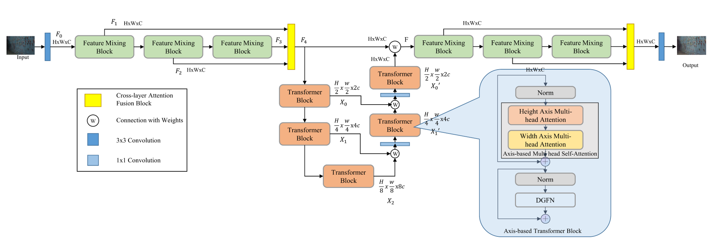

# Low-Light-Image-Enhancement
A task for low-light-image-enhancement
# Network Architecture

# Get Start
## Clone Repo
```
git clone https://github.com/Askobry/Low-Light-Image-Enhancement.git
```
## Pretrained models
[[Baiduyun Pan](https://pan.baidu.com/s/1V5cLs1P8LIOwE-svoCDRtw)]
Code：szub
## Dataset
LOL [[Link](https://daooshee.github.io/BMVC2018website/)]
# Reference Repositories
- LLFormer: https://github.com/TaoWangzj/LLFormer
- FLW-Net: https://github.com/hitzhangyu/FLW-Net
- ShuffleMixer: https://github.com/sunny2109/ShuffleMixer
